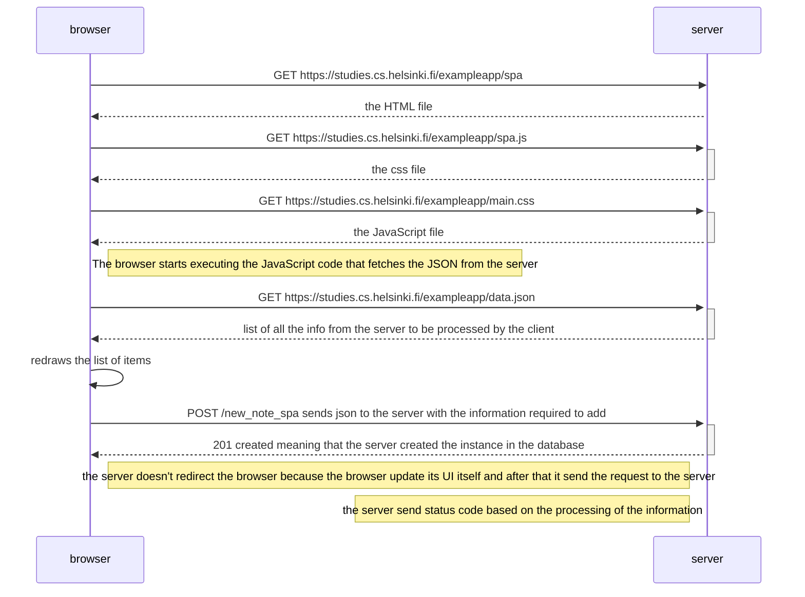

```mermaid
sequenceDiagram
    participant browser
    participant server

    browser->>server: GET https://studies.cs.helsinki.fi/exampleapp/spa
    activate server
    server-->>browser: the HTML file

    browser->>server: GET https://studies.cs.helsinki.fi/exampleapp/spa.js
    activate server
    server-->>browser: the css file
    deactivate server

    browser->>server: GET https://studies.cs.helsinki.fi/exampleapp/main.css
    activate server
    server-->>browser: the JavaScript file
    deactivate server

    Note right of browser: The browser starts executing the JavaScript code that fetches the JSON from the server

    browser->>server: GET https://studies.cs.helsinki.fi/exampleapp/data.json
    activate server
    server-->>browser: list of all the info from the server to be processed by the client
    deactivate server


    browser->>browser: redraws the list of items
    browser->>server: POST /new_note_spa sends json to the server with the information required to add
    activate server
    server-->>browser: 201 created meaning that the server created the instance in the database
    deactivate server

    Note right of browser: the server doesn't redirect the browser because the browser update its UI itself and after that it send the request to the server
    Note left of server: the server send status code based on the processing of the information
```
```
